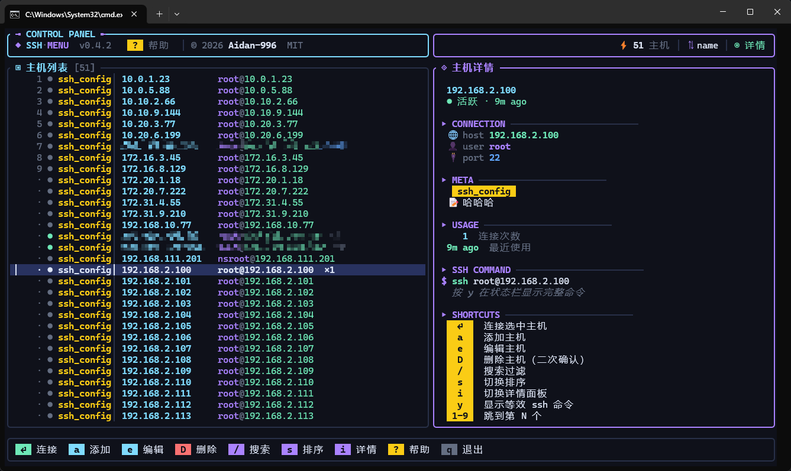

# ssh-menu

> **终端里的 SSH 连接收藏夹**
> 一次录入，永久复用；选中回车，直接上机。

[](https://github.com/Aidan-996/ssh-menu/releases/latest)
[](LICENSE)
[](https://github.com/Aidan-996/ssh-menu/actions/workflows/ci.yml)
[](#download)

---

## 📚 目录

- [📦 最新版本 / 下载](#-最新版本--下载)
- [📖 这是什么](#-这是什么)
- [🚀 一分钟上手（傻瓜式部署）](#-一分钟上手傻瓜式部署)
- [🖼️ 界面速览](#️-界面速览)
- [⌨️ 快捷键](#️-快捷键)
- [🗂️ 配置文件](#️-配置文件)
- [📟 命令行](#-命令行)
- [🌱 环境变量](#-环境变量)
- [❓ 常见问题](#-常见问题)
- [🧱 代码架构](#-代码架构)
- [🗺️ Roadmap](#️-roadmap)
- [📜 版本历史](#-版本历史)
- [📄 License](#-license)

---

## 📦 最新版本 / 下载

### 🚀 最新稳定版

**👉 [点这里下载 Releases](https://github.com/Aidan-996/ssh-menu/releases/latest)**

每个版本都提供 4 个平台的**预编译单文件二进制**（不需要装任何运行时、不需要 cargo）：

| 平台 | 文件名 | 解压后 |
|---|---|---|
| 🪟 **Windows 10/11（x64）** | `ssh-menu-x86_64-pc-windows-msvc.zip` | `ssh-menu.exe` |
| 🐧 **Linux（x64）** | `ssh-menu-x86_64-unknown-linux-gnu.tar.gz` | `ssh-menu` |
| 🍎 **macOS（Intel）** | `ssh-menu-x86_64-apple-darwin.tar.gz` | `ssh-menu` |
| 🍎 **macOS（Apple Silicon）** | `ssh-menu-aarch64-apple-darwin.tar.gz` | `ssh-menu` |

### 📜 历史版本

所有版本的**中文发布说明**都能在 [Releases 页面](https://github.com/Aidan-996/ssh-menu/releases) 每个 tag 下面看到。简表：

| 版本 | 日期 | 亮点 |
|---|---|---|
| [v0.4.2](https://github.com/Aidan-996/ssh-menu/releases/tag/v0.4.2) | 2026-04-24 | 代码质量修复 + 文档完善 + 新图标 |
| [v0.4.1](https://github.com/Aidan-996/ssh-menu/releases/tag/v0.4.1) | 2026-04-24 | Windows exe 内嵌图标 + 版本信息 |
| [v0.4.0](https://github.com/Aidan-996/ssh-menu/releases/tag/v0.4.0) | 2026-04-24 | 断开后自动回菜单，不再连一次就退 |
| [v0.3.1](https://github.com/Aidan-996/ssh-menu/releases/tag/v0.3.1) | 2026-04-24 | Control Panel 加版权行 |
| [v0.3.0](https://github.com/Aidan-996/ssh-menu/releases/tag/v0.3.0) | 2026-04-24 | 🎨 科技感深色主题 + 卡片式详情面板 |
| [v0.2.1](https://github.com/Aidan-996/ssh-menu/releases/tag/v0.2.1) | 2026-04-24 | 圆角边框 + 分组自动着色 |
| [v0.2.0](https://github.com/Aidan-996/ssh-menu/releases/tag/v0.2.0) | 2026-04-24 | 使用统计 + 4 种排序 + 详情面板 + 帮助蒙层 |
| [v0.1.1](https://github.com/Aidan-996/ssh-menu/releases/tag/v0.1.1) | 2026-04-24 | 导入去重 + `ssh` 查找兜底 + 代码模块化 |
| [v0.1.0](https://github.com/Aidan-996/ssh-menu/releases/tag/v0.1.0) | 2026-04-24 | 🎉 首次发布 |

完整变更：[CHANGELOG.md](CHANGELOG.md)

---

## 📖 这是什么

### 解决什么痛点

如果你每天都这样连服务器：

```bash
ssh -i ~/.ssh/id_rsa -p 2222 root@203.0.113.10
ssh -i ~/.ssh/prod_key -p 22 -J bastion.corp admin@10.0.0.5
ssh -o ServerAliveInterval=30 ubuntu@some-very-long.example.com
```

你遇到的问题通常是：

- **记不住一堆 IP/端口/密钥路径**，每次都要翻 `~/.ssh/config` 或笔记
- `~/.ssh/config` 能用，但**没 UI**，没法直观看到有哪些主机、最近连过哪台
- 想加一台新机器得**手动编辑 config 文件**，格式容易写错
- 多套环境（生产/测试/云/内网）**混在一起**，没分组没标签
- 跳板机、多级跳板，**`-J` 参数拼起来容易错**

### ssh-menu 的定位

一个**终端里的 SSH 连接收藏夹 + 快速启动器**。不替代 `ssh`，而是站在 `ssh` 前面帮你挑主机：

- 🎯 **所有主机一张表**，按方向键选，回车连接
- 🎯 **分组、标签、备注、使用次数**一目了然
- 🎯 **跳板机** `jump = "bastion"` 一行搞定，不用记 `-J` 语法
- 🎯 **实时搜索** `/` 输入关键词即时过滤
- 🎯 **导入现有 `~/.ssh/config`** 一键迁移
- 🎯 **断开后自动回菜单** 接着连下一台
- 🎯 **使用统计** 自动记录每台主机的连接次数和最近使用时间

### 它**不是**什么

- ❌ **不是 SSH 客户端替代品**：ssh-menu 把参数拼好后直接 `exec` 系统 `ssh`，**所有原生行为保留**（tmux/nvim/复制粘贴/agent forwarding/known_hosts …）
- ❌ **不是终端模拟器**：没有内嵌 PTY，也不做终端渲染
- ❌ **不是云平台管理工具**：不接入 AWS/阿里云 API，它只管理 SSH 连接

### 技术栈

- **语言**：Rust（2021 edition）
- **UI**：`ratatui` + `crossterm`（纯文本终端 UI，跨平台）
- **配置**：TOML，存 `~/.ssh-menu.toml`
- **单文件二进制**：无运行时依赖，下载即用
- **体积**：约 1.3 MB（Windows，含内嵌图标）

---

## 🚀 一分钟上手（傻瓜式部署）

### Windows 用户

#### 步骤 1：装 OpenSSH 客户端（Windows 10 及以上已默认安装）

打开 PowerShell，执行：

```powershell
ssh -V
```

看到版本号就 OK，跳到步骤 2。
看到"找不到命令"，按 `Win` 键 → 搜"可选功能" → `添加功能` → 勾选 **OpenSSH 客户端** → 确认。

#### 步骤 2：下载 ssh-menu

1. 打开 👉 **[Releases 最新版](https://github.com/Aidan-996/ssh-menu/releases/latest)**
2. 下载 `ssh-menu-x86_64-pc-windows-msvc.zip`
3. 解压得到 `ssh-menu.exe`

#### 步骤 3：放到 PATH 里

把 `ssh-menu.exe` 复制到以下任意一个目录（选一个存在的即可）：

```
C:\Windows\System32\                  （最省事，全系统可用，需管理员）
C:\Users\<你的用户名>\.cargo\bin\        （如果装过 Rust，天然在 PATH）
C:\Users\<你的用户名>\AppData\Local\Microsoft\WindowsApps\
```

或者新建一个目录比如 `C:\tools\`，然后把它加到系统 PATH：
`Win` → 搜"环境变量" → `编辑系统环境变量` → `环境变量` → 用户变量 `Path` → 新建 → 填 `C:\tools`。

#### 步骤 4：首次使用

打开**任意终端**（CMD / PowerShell / Windows Terminal / Git Bash）：

```bash
# 如果你已经有 ~/.ssh/config，一键导入
ssh-menu import

# 启动
ssh-menu
```

第一次没有主机？直接在界面里按 `a` 添加即可。

---

### Linux 用户

```bash
# 1. 下载（以 x64 为例）
curl -L -o ssh-menu.tar.gz \
  https://github.com/Aidan-996/ssh-menu/releases/latest/download/ssh-menu-x86_64-unknown-linux-gnu.tar.gz

# 2. 解压、装到 /usr/local/bin
tar xzf ssh-menu.tar.gz
sudo install -m 0755 ssh-menu /usr/local/bin/

# 3. 验证
ssh-menu --version

# 4. 使用
ssh-menu import    # 导入已有 ~/.ssh/config
ssh-menu           # 启动
```

---

### macOS 用户

```bash
# Intel Mac
ARCH=x86_64-apple-darwin
# Apple Silicon（M 系列芯片）
ARCH=aarch64-apple-darwin

curl -L -o ssh-menu.tar.gz \
  https://github.com/Aidan-996/ssh-menu/releases/latest/download/ssh-menu-$ARCH.tar.gz
tar xzf ssh-menu.tar.gz
sudo install -m 0755 ssh-menu /usr/local/bin/

ssh-menu --version
ssh-menu import
ssh-menu
```

> 首次运行 macOS 可能提示"无法验证开发者" → 系统设置 → 隐私与安全 → `仍然允许`。

---

### 用 Cargo 安装（程序员流）

如果你已经装了 Rust 工具链：

```bash
cargo install ssh-menu
```

安装后 `ssh-menu` 自动出现在 `~/.cargo/bin/`，确保该目录在 PATH 即可。

---

### 从源码编译

```bash
git clone https://github.com/Aidan-996/ssh-menu
cd ssh-menu
cargo build --release
# 二进制在 target/release/ssh-menu (Windows 为 ssh-menu.exe)
```

编译大约 1~2 分钟，需要 Rust 1.70+。Windows 下会自动嵌入图标和版本信息。

---

## 🖼️ 界面速览



```
┌─ CONTROL PANEL ────────────────┬────────────────────────────────────┐
│ ◆ SSH·MENU  v0.4.2  [?] 帮助 │ │          ⚡ 12 主机 · ⇅ 排序 · ◉ │
│ © 2026 Aidan-996  MIT         │ │                                   │
└────────────────────────────────┴────────────────────────────────────┘
┌─ ▣ 主机列表 [12] ────────┬─ ◈ 主机详情 ─────────────────────────┐
│ ▎ 1 ● prod      │ prod-db │                                     │
│   2 ● prod      │ web     │   prod-db                           │
│   3 ● cloud     │ vps     │   ● 活跃 · 3h ago                   │
│   4 ● internal  │ win-gw  │                                     │
│   5 ○ backup    │ nas     │  ▸ CONNECTION ──────────            │
│                           │   🌐 host    db.example.com         │
│                           │   👤 user    root                   │
│                           │   🔌 port    22                     │
│                           │                                     │
│                           │  ▸ USAGE ──────────                 │
│                           │      12  连接次数                   │
│                           │   3h ago  最近使用                  │
│                           │                                     │
│                           │  ▸ SHORTCUTS ──────────             │
│                           │    ⏎   连接选中主机                 │
│                           │    /   搜索过滤                     │
│                           │                                     │
│                           │  ▸ ABOUT ──────────                 │
│                           │   🔌 ssh-menu v0.4.2                │
└───────────────────────────┴─────────────────────────────────────┘
 ⏎ 连接  a 添加  e 编辑  D 删除  / 搜索  s 排序  i 详情  ? 帮助  q 退出
```

---

## ⌨️ 快捷键

在 TUI 里随时按 **`?`** 打开帮助蒙层看完整列表。

### 普通模式

| 按键 | 动作 |
|---|---|
| `↑`/`↓` 或 `j`/`k` | 移动光标 |
| `PgUp` / `PgDn` | 翻 10 行 |
| `g` / `G` 或 `Home`/`End` | 跳到首项 / 末项 |
| `1`–`9` | 跳到第 N 个 |
| 任意字母 | 跳到下一个首字母匹配的主机 |
| **`Enter`** | **连接当前选中** |
| `/` | 进入搜索模式 |
| `a` | 添加新主机 |
| `e` | 编辑当前选中 |
| `D`（Shift+d） | 删除（二次确认 `y/N`） |
| `y` | 状态栏显示等效 `ssh` 命令 |
| `s` | 切换排序：名称 → 分组 → 最近 → 最多 |
| `i` | 切换详情面板 |
| `r` | 刷新过滤 |
| `?` | 打开帮助 |
| `q` / `Esc` | 退出 |
| `Ctrl-C` | 强制退出 |

### 搜索模式（按 `/` 进入）

- 任意字符即时过滤（子串匹配 name/host/user/group/tags）
- `Backspace` 删字符，`Ctrl-U` 清空
- `↑`/`↓` 在过滤结果中移动
- `Enter`：过滤只剩 1 条时直接连接
- `Esc` 清空并回到普通模式

### 表单模式（添加/编辑时）

- `Tab` / `↑` / `↓` 切换字段
- `Ctrl-U` 清空当前字段
- `Enter` 或 `Ctrl-S` 保存
- `Esc` 取消

---

## 🗂️ 配置文件

默认路径：

- Linux / macOS：`~/.ssh-menu.toml`
- Windows：`C:\Users\<你>\.ssh-menu.toml`

### 格式示例

```toml
# 最小示例
[[hosts]]
name = "prod-db"
host = "db.example.com"
user = "root"

# 完整字段
[[hosts]]
name  = "prod-db"                    # 必填 · 显示别名（支持中文）
host  = "db.example.com"             # 必填 · IP 或域名
user  = "root"                       # 默认 root
port  = 22                           # 默认 22
key   = "~/.ssh/id_rsa"              # 可选 · 私钥路径，支持 ~/
group = "prod"                       # 可选 · 分组（自动着色）
tags  = ["mysql", "linux"]           # 可选 · 标签，用于搜索
note  = "主库，小心 DROP"             # 可选 · 备注（详情面板显示）
jump  = "bastion"                    # 可选 · 跳板机，填另一台主机的 name
extra = ["-o", "ServerAliveInterval=30"]  # 可选 · 额外 ssh 参数

# 这两个字段由工具自动维护，无需手填
# last_used = "2026-04-24T15:30:12+08:00"
# use_count = 12
```

### 字段说明

| 字段 | 类型 | 必填 | 说明 |
|---|---|---|---|
| `name` | string | ✅ | 列表显示的别名，支持中文 |
| `host` | string | ✅ | IP 或主机名 |
| `user` | string | ❌ | 登录用户，默认 `root` |
| `port` | u16 | ❌ | SSH 端口，默认 `22` |
| `key` | string | ❌ | 私钥路径，支持 `~/` 展开 |
| `group` | string | ❌ | 分组名，用于视觉聚合（自动哈希着色） |
| `tags` | [string] | ❌ | 标签数组，`#tag` 样式显示，可被搜索匹配 |
| `note` | string | ❌ | 自由备注，仅在详情面板显示 |
| `jump` | string | ❌ | 跳板主机，填另一条 `hosts` 的 `name` |
| `extra` | [string] | ❌ | 额外 ssh 参数，会原样追加到命令行 |
| `last_used` | string | 自动 | RFC3339 时间戳，自动更新 |
| `use_count` | u64 | 自动 | 累计连接次数，自动 +1 |

### 自定义配置文件路径

```bash
# 方式 1：命令行参数
ssh-menu --config /path/to/custom.toml

# 方式 2：环境变量
export SSH_MENU_CONFIG=/path/to/custom.toml
ssh-menu
```

---

## 📟 命令行

```
ssh-menu [OPTIONS] [COMMAND]
```

| 命令 | 说明 |
|---|---|
| `ssh-menu` | 启动交互式 TUI（默认） |
| `ssh-menu tui` | 同上 |
| `ssh-menu list` | 纯文本列出所有主机（方便 grep） |
| `ssh-menu connect NAME` | 不开 TUI，直接按名称连接 |
| `ssh-menu import` | 从 `~/.ssh/config` 合并导入（去重） |
| `ssh-menu import --from PATH` | 从指定 ssh_config 导入 |
| `ssh-menu path` | 打印当前配置文件路径 |
| `ssh-menu --version` | 显示版本 |
| `ssh-menu --help` | 显示所有选项 |

### 使用场景示例

```bash
# 快速连某台（shell 脚本里很有用）
ssh-menu connect prod-db

# 查看配置在哪
ssh-menu path

# 批量导出主机名做 Ansible inventory
ssh-menu list | awk '{print $2}'
```

---

## 🌱 环境变量

| 变量 | 作用 |
|---|---|
| `SSH_MENU_CONFIG` | 覆盖默认配置文件路径 |
| `SSH_MENU_SSH` | 指定 `ssh` 可执行文件路径（PATH 找不到时用） |

### 找不到 `ssh.exe`（Windows）

工具会按以下顺序自动查找：

1. `$SSH_MENU_SSH` 环境变量
2. `PATH` 中的 `ssh`
3. `C:\Windows\System32\OpenSSH\ssh.exe`
4. `C:\Program Files\OpenSSH\ssh.exe`
5. `C:\Program Files\Git\usr\bin\ssh.exe`（Git for Windows）

全都找不到才会报错。

---

## ❓ 常见问题

**Q：它会替换 `ssh` 吗？会影响我的 `~/.ssh/config` 吗？**
不会。ssh-menu 只是帮你拼好 `ssh` 的参数（`-i`、`-p`、`-J`、`extra` 等），然后直接 `exec` 系统 `ssh`。你现有的 agent、密钥、known_hosts、`~/.ssh/config` 全部不受影响。导入只是**读取**，不会修改。

**Q：我已经习惯了 `~/.ssh/config`，还用 ssh-menu 有啥好处？**
两点：(1) `~/.ssh/config` 没 UI，ssh-menu 让你可视化选择、搜索、分组；(2) ssh-menu 会自动记录每台主机的连接次数和最近时间，排序功能能把常用的顶到前面。

**Q：支持 Windows 吗？需要 WSL 吗？**
支持原生 Windows。**不需要 WSL**。需要 Windows 10+ 自带的 OpenSSH 客户端（如果没装，Windows 可选功能里加一下）。

**Q：连接上之后为什么 TUI 不见了？**
这是有意设计。选主机回车后，TUI 退出，把终端交给 `ssh`，**100% 原生终端体验**（tmux/vim/颜色/复制粘贴都不受影响）。ssh 会话结束后按任意键就会回到菜单。

**Q：如何跳板机？**
在配置里填 `jump = "bastion-的-name"`。ssh-menu 会自动拼 `-J user@host:port` 给你。多级跳板暂不支持，但你可以在 `extra` 里手写 `-J a,b,c`。

**Q：我的密码/密钥安全吗？**
ssh-menu 从不处理密码，只存密钥**路径**。实际认证交给系统 `ssh`。配置文件 `~/.ssh-menu.toml` 是纯文本，和 `~/.ssh/config` 安全等级相同，**不要上传到公共仓库**。

**Q：支持 SFTP / SCP 吗？**
还没。已在 Roadmap。

**Q：支持鼠标点击吗？**
当前主要是键盘驱动。如果强需求我再加。

**Q：能否自定义配色？**
还没。计划在 v0.5 加 theme 文件。

---

## 🧱 代码架构

```
ssh-menu/
├── Cargo.toml                # 依赖 + 版本号 + release profile
├── build.rs                  # Windows 图标 + 版本资源编译期嵌入
├── assets/
│   └── icon.svg              # 图标源文件（编辑后 cargo build 会自动重新生成 .ico）
├── README.md                 # 本文件
├── CHANGELOG.md              # 详细变更日志
├── LICENSE                   # MIT
├── config.example.toml       # 配置文件示例
├── .github/
│   ├── workflows/
│   │   ├── ci.yml            # 三平台 CI：cargo build + cargo test
│   │   └── release.yml       # tag v* 触发 → 交叉编译 4 平台 → 上传 Release
│   └── release-notes/
│       ├── v0.1.0.md         # 每个版本独立的中文 release notes
│       ├── v0.1.1.md
│       ├── ...
│       └── v0.4.2.md
└── src/
    ├── main.rs               # CLI 入口、子命令分发、主菜单循环
    ├── config/               # 配置层（纯数据 + I/O，零 UI 依赖）
    │   ├── mod.rs
    │   ├── model.rs          #   Config / Host 结构
    │   └── store.rs          #   加载 / 保存 / 路径解析
    ├── ssh/                  # SSH 层（只依赖 config）
    │   ├── mod.rs
    │   ├── connect.rs        #   argv 构造 + ssh 查找 + 进程启动 + 时间工具
    │   └── import.rs         #   ~/.ssh/config 解析 + 合并去重
    └── tui/                  # 终端 UI 层（组合 config + ssh）
        ├── mod.rs
        ├── app.rs            #   应用状态机
        ├── form.rs           #   添加/编辑表单
        ├── events.rs         #   键盘事件派发
        ├── view.rs           #   渲染
        └── runtime.rs        #   终端生命周期 + 事件循环
```

### 分层职责

- `config::` — 纯数据与 I/O，不依赖任何 UI 或 ssh 逻辑
- `ssh::` — 仅依赖 `config::`，负责命令拼装和进程启动
- `tui::` — 组合 `config::` 和 `ssh::`，封装终端交互
- `main.rs` — CLI 解析 + 子命令到各模块的桥接 + 主菜单循环

---

## 🗺️ Roadmap

- [ ] SFTP / SCP 上传下载（`u` / `U` 快捷键）
- [ ] 多级跳板机链
- [ ] 主题自定义（可加载外部 theme.toml）
- [ ] 模糊匹配（目前是子串匹配）
- [ ] 多选 + 批量操作（批量删除 / 批量改分组）
- [ ] 导出回 OpenSSH config 格式
- [ ] 每主机 pre/post 钩子（连接时本地命令、通知）
- [ ] 单元测试覆盖

欢迎在 [Issues](https://github.com/Aidan-996/ssh-menu/issues) 提需求。

---

## 📜 版本历史

详细变更日志见 [CHANGELOG.md](CHANGELOG.md)。
每个版本的中文发布说明见 [Releases 页面](https://github.com/Aidan-996/ssh-menu/releases) 各 tag。

---

## 📄 License

MIT © 2026 [Aidan-996](https://github.com/Aidan-996)
